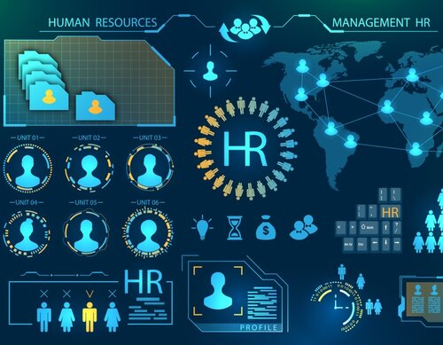

# Human Resources Attrition Analysis

## Introduction

This is a PowerBI project on employee attrition of an imaginary organization called 'Demo'. This project is to analyze and derive insights to answer questions on factors responsible for attrition and help the organization make data driven decisions.

_Disclaimer: all data sets and reports do not represent any company or country. But just a dummy dataset to demonstrate capabilities of business inteligence_

## Problem Statement

Employee attrition is a major cost to an organization and providing lasting solutions to such attritions is the most important requirement of the Human Resources department in many organizations. In this case study I want to investigate the following factors.
1. What is the Rate of Attrition
2. What are the factors resposible for attrition
3. Employee Performance Index relative to attrition

## Skills Demonstrated
The following powerbi features were utilized
- DAX
- Measures
- Page Navigation
- Modeling
- Conditional column formating in Power Query

## Modelling

There are 5 Dimension tables and 1 fact table
Automatic relationship was established between  2 dimension tables and the fact table due to the fact that none of the remaining dim_Tables share the same column headers. Hence I used snowflake schema to establish relationship between these tables using DAX function 'USERELATIONSHIP' 

## Visualization
The Report comprises of 4 pages:

1. Overview
2. Demography
3. Performance Tracker
4. Employee Attrition

You can interact with the report [here]()

## Analysis

### Overview

The company recruited 1,470 employees within the period of 11 years ranging (2012 - 2022), 237 employee left the organization within this period, presently the organization is left with 1,233  employee  which i categorized as 'Active Employee'

### Demography

This is a the structure of employee population (Gender, Ethnic Group, Age group)
Total Number of employee is (1,470), 651 of the employee are male and 675 are female (144 fall into other gender categories)
Majority of employee are within the age group 20-29
Mixed or Multiple ethnic groups have one of the lowest salary

### Performance Tracker

The maximun performance rating and job satisfaction an employee could get is 5, it was established that an employee with high or relatively high managerial rating will not only perform well on the job but maintain good rapport with colleagues and a proper work life balance

### Attrition

Employees who are frequent travellers have the highest attrition rate

## Conlusion and Recomendation

Although the reasons for attrition are often something you cannot prevent, there are a few things the organization  can do to lower the chances of it happening
1. Human Resources department should careully evaluate and establish a proper hiring plan  putting into context how  frequent  an employee need to be on business travels
2. Periodic survey should be conducted among employees 

_For a intensive dive into the analytics, employee resons for attrition(paying under market vale, bad wok envinronment etc) should be included in the datasetd_

 
